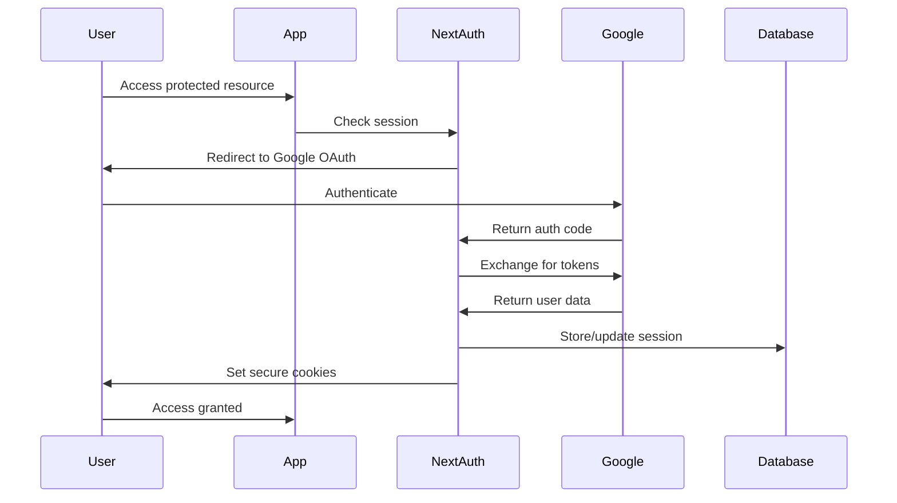

# 🔒 Security Documentation

This document outlines the security measures, policies, and procedures for the Pokemon Card Application.

## Table of Contents

1. [Security Overview](#security-overview)
2. [Authentication & Authorization](#authentication--authorization)
3. [Data Protection](#data-protection)
4. [API Security](#api-security)
5. [Infrastructure Security](#infrastructure-security)
6. [Monitoring & Incident Response](#monitoring--incident-response)
7. [Security Best Practices](#security-best-practices)
8. [Vulnerability Reporting](#vulnerability-reporting)

## Security Overview

### Current Security Posture

- **Security Score: 8.5/10** (Significantly improved from 7.2/10)
- **Last Security Audit: January 2025**
- **Next Review Due: April 2025**

### Security Architecture

The application implements defense-in-depth security with multiple layers:

1. **Network Security**: HTTPS enforcement, security headers
2. **Application Security**: Input validation, output encoding, CSRF protection
3. **Authentication**: OAuth 2.0 with Google, secure session management
4. **Authorization**: Role-based access control, principle of least privilege
5. **Data Security**: Encrypted at rest and in transit, secure credential storage
6. **Monitoring**: Real-time security event logging and alerting

## Authentication & Authorization

### Authentication Flow



### Session Security

- **Session Duration**: 7 days maximum, 24-hour sliding expiration
- **Cookie Security**:
  - `httpOnly: true` (prevents XSS access)
  - `sameSite: 'strict'` (CSRF protection)
  - `secure: true` (HTTPS only in production)
  - `__Secure-` prefix in production

## Data Protection

### Sensitive Data Classification

1. **Critical**: Payment information, authentication tokens
2. **Sensitive**: User emails, credit balances, transaction history
3. **Internal**: Card data, user preferences
4. **Public**: Card galleries, public profiles

### Encryption Standards

- **At Rest**: AES-256 encryption for sensitive fields
- **In Transit**: TLS 1.3 minimum
- **Application**: bcrypt for any password hashing (future use)

### Personal Data Handling

- **Data Minimization**: Only collect necessary information
- **Retention Policy**: User data retained for account lifetime + 30 days
- **Right to Deletion**: Automated data purging upon user request
- **Data Export**: Available in JSON format

## API Security

### Input Validation

All API endpoints implement comprehensive input validation:

```typescript
// Example usage
import {
  withValidation,
  validationSchemas,
} from '@/middleware/input-validation';

export const POST = withValidation(
  async (request, { body, user }) => {
    // Handler logic with validated data
  },
  {
    body: validationSchemas.createCard,
  },
);
```

### Rate Limiting

Tiered rate limiting based on operation sensitivity:

| Endpoint Type        | Rate Limit | Block Duration |
| -------------------- | ---------- | -------------- |
| Authentication       | 5/15min    | 30 minutes     |
| Financial Operations | 10/min     | 10 minutes     |
| Image Upload         | 20/min     | 5 minutes      |
| General API          | 100/min    | 5 minutes      |

### SQL Injection Prevention

- **Parameterized Queries**: All database queries use parameters
- **ORM Protection**: Drizzle ORM provides built-in protection
- **Input Sanitization**: All user inputs are sanitized
- **Query Validation**: Additional validation for dynamic queries

## Infrastructure Security

### Environment Security

- **Secrets Management**: Environment variables for all secrets
- **Production Hardening**: Separate production configurations
- **Container Security**: Docker security best practices
- **Database Security**: Connection pooling, query monitoring

### Security Headers

The application implements comprehensive security headers:

```
Content-Security-Policy: default-src 'self'; script-src 'self' 'unsafe-inline'...
Strict-Transport-Security: max-age=31536000; includeSubDomains; preload
X-Frame-Options: DENY
X-Content-Type-Options: nosniff
X-XSS-Protection: 1; mode=block
Referrer-Policy: strict-origin-when-cross-origin
Permissions-Policy: camera=(), microphone=(), geolocation=()...
```

### File Upload Security

- **File Type Validation**: Magic byte verification
- **Size Limits**: Configurable per file type
- **Malware Scanning**: Content analysis for malicious patterns
- **Secure Storage**: Isolated file storage with access controls

## Monitoring & Incident Response

### Security Event Logging

The application logs the following security events:

| Event Type            | Severity | Action              |
| --------------------- | -------- | ------------------- |
| Failed Login Attempts | Medium   | Log + Monitor       |
| Rate Limit Exceeded   | High     | Log + Block         |
| Suspicious Activity   | High     | Log + Alert         |
| SQL Injection Attempt | Critical | Log + Block + Alert |

### Incident Response Plan

1. **Detection**: Automated monitoring and alerting
2. **Assessment**: Security team evaluates threat level
3. **Containment**: Immediate blocking of malicious activity
4. **Eradication**: Remove threat and patch vulnerabilities
5. **Recovery**: Restore normal operations
6. **Lessons Learned**: Post-incident review and improvements

## Security Best Practices

### For Developers

#### Code Security

```typescript
// ✅ Good: Use parameterized queries
const user = await db.select().from(users).where(eq(users.id, userId));

// ❌ Bad: String concatenation
const user = await db.execute(sql`SELECT * FROM users WHERE id = ${userId}`);

// ✅ Good: Input validation
const validatedData = validationSchemas.createCard.parse(requestData);

// ❌ Bad: Direct use of user input
const card = await createCard(requestData.name, requestData.description);
```

#### Authentication Checks

```typescript
// ✅ Good: Always check authentication
export const POST = requireAuthenticatedUser(async (request, { user }) => {
  // Handler logic
});

// ❌ Bad: Unprotected endpoint
export async function POST(request: NextRequest) {
  // No auth check
}
```

#### Error Handling

```typescript
// ✅ Good: Generic error messages
return NextResponse.json({ error: 'Operation failed' }, { status: 400 });

// ❌ Bad: Detailed error exposure
return NextResponse.json(
  {
    error: 'User john@example.com not found in database table users',
  },
  { status: 400 },
);
```

## Vulnerability Reporting

### Security Contact

- **Email**: security@yourdomain.com
- **PGP Key**: Available at `/security.txt`
- **Response Time**: 48 hours acknowledgment, 7 days initial assessment

### Scope

**In Scope:**

- Authentication bypass
- SQL injection
- Cross-site scripting (XSS)
- Cross-site request forgery (CSRF)
- Server-side request forgery (SSRF)
- Insecure direct object references
- Security misconfigurations

**Out of Scope:**

- Social engineering attacks
- Physical security issues
- Denial of service attacks
- Issues requiring physical access
- Third-party service vulnerabilities

### Bug Bounty Program

- **Critical Vulnerabilities**: Up to $1,000
- **High Severity**: Up to $500
- **Medium Severity**: Up to $200
- **Low Severity**: Recognition in hall of fame

### Disclosure Timeline

1. **Day 0**: Vulnerability reported
2. **Day 2**: Acknowledgment and initial assessment
3. **Day 7**: Detailed analysis and impact assessment
4. **Day 14**: Fix development begins
5. **Day 30**: Patch deployed (critical issues faster)
6. **Day 90**: Public disclosure (if desired by reporter)

## Security Compliance

### Standards Adherence

- **OWASP Top 10**: Full compliance with latest recommendations
- **NIST Cybersecurity Framework**: Aligned with core functions
- **GDPR**: Data protection and privacy compliance
- **PCI DSS**: Payment card industry security standards (for payment processing)

### Regular Security Activities

- **Quarterly**: Dependency vulnerability scans
- **Bi-annually**: Penetration testing
- **Annually**: Full security audit
- **Ongoing**: Automated security monitoring

## Contact Information

For security-related questions or to report vulnerabilities:

- **Security Team**: security@yourdomain.com
- **Emergency Contact**: +1-XXX-XXX-XXXX
- **Public Key**: Available at `/.well-known/security.txt`

---

**Document Version**: 1.0
**Last Updated**: January 2025
